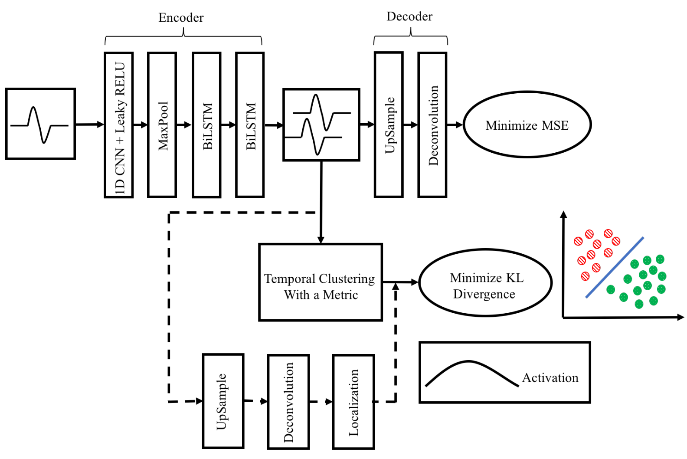

# DTC: Deep Temporal Clustering

This is a Keras implementation of the **Deep Temporal Clustering (DTC)** model, an architecture for joint representation learning and clustering on multivariate time series, presented in the paper [1]:

> Madiraju, N. S., Sadat, S. M., Fisher, D., & Karimabadi, H. (2018). Deep Temporal Clustering : Fully Unsupervised Learning of Time-Domain Features. http://arxiv.org/abs/1802.01059

It aims at reproducing the model from the paper with all its features and distance metrics, including:

* **Heatmap-generating network** to visualize the regions of the time series that contribute to cluster assignment
* Cluster initialization with either hierarchical clustering or k-means
* **4 distance metrics between time series** used for initialization with hierarchical clustering and in the Student kernel to compute similarity scores between latent time series:
  * Euclidean distance (EUCL)
  * Complexity-Invariant Distance (CID)
  * Correlation coefficient-based distance (COR)
  * Autocorrelation-based distance (ACF) [NOT IMPLEMENTED YET]

I draw attention on the fact that unlike many time series algorithm implementations, this implementation is fully compatible with **multivariate** time series.

This implementation ships with the datasets from the [UCR/UEA univariate and multivariate time series classification archives](http://http://www.timeseriesclassification.com/) [2,3], available through the [tslearn](https://github.com/rtavenar/tslearn) library [4] ([yichangwang's fork](https://github.com/yichangwang/tslearn) for multivariate datasets archive).



**Disclaimer**: as the original authors did not publish their code, there is no guarantee that this implementation is *exactly* identical. In particular, there are not much details about how the heatmap-generating network was designed and trained.

## Basic usage

The model is implemented in a generic way so that most hyper-parameters, such as network architecture, can be tuned using command-line arguments.

To train a DTC model, run the main script `DeepTemporalClustering.py` with command-line arguments. Available arguments are explained with:

```shell
$ python3 DeepTemporalClustering.py --help
```

## Example

TODO

## Repository structure

* *DeepTemporalClustering.py*: main script containing the model (DTC class)
* *TSClusteringLayer.py*: script containing the time series clustering layer
* *TAE.py*: script containing the Temporal Autoencoder
* *tsdistances.py*: time series distances in numpy
* *datasets.py*: script for loading the UCR/UEA datasets
* *metrics.py*: script containing functions to compute performance metrics (purity, unsupervised clustering accuracy and ROC-AUC). NMI is already available in scikit-learn.

## Implementation details

### Multivariate Time Series

All functions were designed with Multivariate Time Series (MTS) in mind from the beginning. Here are the mathematical expressions of the MTS distance functions that were implemented.

TODO

### Heatmap network

The heatmap-generating network is trained when `--heatmap` is set to `True`.

**29/07/19 update**: The training procedure of the heatmap network now follows [1] and [5] (page 6: "We set its initial value to 0.1 so that the network more focuses on learning the representative features at the early stage, and it is increased to 0.9 after 60 epochs to fine-tune the localizer.").

The clustering module and heatmap network are trained together with a weighted KL-divergence loss:

$$\mathcal{L} = (1 - \eta) \mathcal{L}_{clust} + \eta \mathcal{L}_{heatmap}$$

At the beginning of training, the weight of the heatmap loss is fixed to a small value $\eta$, and after a specified number of epochs, it is increased to a large value for finetuning. This is controlled by 3 hyper-parameters:

* `initial_heatmap_loss_weight`: initial weight of heatmap loss vs clustering loss (default: 0.1 as in [5])
* `final_heatmap_loss_weight`: final weight of heatmap loss vs clustering loss (heatmap finetuning) (default: 0.9 as in [5])
* `finetune_heatmap_at_epoch`: epoch where heatmap finetuning starts

TODO

## Dependencies

This implementation was written for Python 3.x.

Dependencies: keras, numpy, scikit-learn, scipy, statsmodels, tslearn (be sure to use tslearn>=0.3.1 for the multivariate datasets).

## Other DTC implementations

The only other implementation available on github is [saeeeeru/dtc-tensorflow](https://github.com/saeeeeru/dtc-tensorflow). However, it is somewhat limited and lacks crucial functionalities that justify this new implementation:

* euclidean distance metric only
* k-means initialization only
* synthetic dataset only
* no heatmap-generating network
* not very generic and not easily tunable

## References

> [1] Madiraju, N. S., Sadat, S. M., Fisher, D., & Karimabadi, H. (2018). Deep Temporal Clustering : Fully Unsupervised Learning of Time-Domain Features. http://arxiv.org/abs/1802.01059

> [2] Dau, H. A., Bagnall, A., Kamgar, K., Yeh, C.-C. M., Zhu, Y., Gharghabi, S., … Keogh, E. (2018). The UCR Time Series Archive. http://arxiv.org/abs/1810.07758

> [3] Bagnall, A., Dau, H. A., Lines, J., Flynn, M., Large, J., Bostrom, A., … Keogh, E. (2018). The UEA multivariate time series classification archive, 2018, 1–36. http://arxiv.org/abs/1811.00075

> [4] Tavenard, R. (2017). tslearn: A machine learning toolkit dedicated to time-series data. https://github.com/rtavenar/tslearn

> [5] Hwang, S., & Kim, H. E. (2016). Self-transfer learning for weakly supervised lesion localization. Lecture Notes in Computer Science, 9901 LNCS, 239–246. https://doi.org/10.1007/978-3-319-46723-8_28
